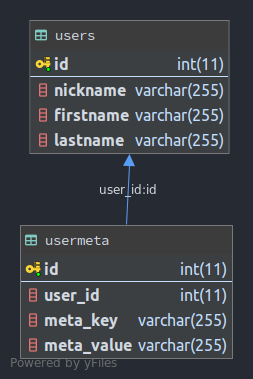
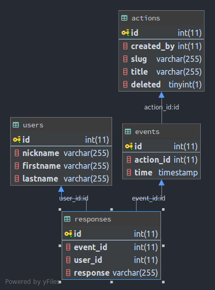
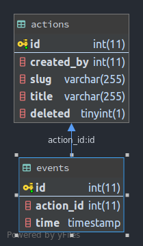

### API

<br>

### Routes
```
users GET
users/:id GET
users POST - json body
users/:id PATCH - json body
users/:id DELETE

usermeta POST - json body
usermeta GET
usermeta/:id GET
usermeta_by_uid/:user_id GET
usermeta/:id PATCH - json body
usermeta/:id DELETE
usermeta_by_uid/:user_id DELETE

actions POST - json body
actions GET
actions/:id GET
actions_by_uid/:user_id GET
actions/:id PATCH - json body
actions/:id DELETE
actions_by_uid/:user_id DELETE

events POST - json body
events GET
events/:id GET
events_by_aid/:action_id GET
events_by_range GET - json body
events_by_range_and_aid/:action_id GET - json body
events/:id PATCH - json body
events/:id DELETE
events_by_aid/:action_id DELETE

responses POST - json body
responses GET
responses/:id GET
responses_by_eid/:event_id GET
responses_by_uid/:user_id GET
responses/:id DELETE
responses_by_eid/:event_id DELETE
responses_by_uid/:user_id DELETE
```

<br>

### Schema
Users and Usermeta <br>

<br>

Responses<br>

<br>

Events and Actions<br>
